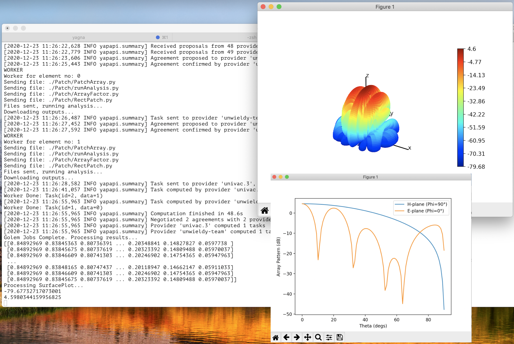

## Antenna Array Design & Simulation - Powered By Golem

[Demo Video](https://youtu.be/wa4zohSWmtA)

Welcome to my Gitcoin Golem Hackathon entry. Traditional antenna design/analysis usually relies on very expensive commercial tooling such as Ansoft HFSS which requires powerful and costly hardware for processing. This creates a high barrier of entry and even when that can be overcome collaboration is difficult due to proprietary file types and seat licensing. This project aims to overcome these issues.

Using Golem to overcome the hardware barrier - [Golem Network](https://golem.network/) is a cloud computing power service where everyone can develop, manage and execute workloads in an unstoppable, inexpensive and censorship-free environment. The project makes use of this by essentially breaking down large problems (i.e. many antenna elements) into single problems (i.e. a single element) that can be run on individual Golem workers. Now anyone can run a large and complex analysis without access to a very expensive, dedicated machine.

The application aims to create a foundational setup that makes it easily extensible without the user requiring knowledge of the Golem system. This make it easy for users to 'drop in' their own element types and run analysis on them. Focus can be on the antenna design rather than the Golem interaction.

Collaboration and knowledge sharing can assist in learning and lead to innovation. Using the extension option anyone can contribute to build a collection of different element types that anyone can run and adapt. This could be developed further to include functionality to add different output types - i.e. more plots, tables, etc and even new solving methods, i.e. 3D Finite Element for microwave structures. A community of passionate contributors and enthusiasts leads to more innovation and can grow an applications development further than an individual can.

### The Application

This application is a Command Line tool that allows a user to simulate antenna patterns for an X by Y element array. For a proper introduction to Antenna Arrays and explanation of the Python code please see my series [here](https://johngrant.medium.com/antenna-arrays-and-python-introduction-8e3b612ecdfb).

Each elements field is processed by a Golem worker. By default a 2x1 rectangular element array is analysed but the configuration can be changed (along with freq, patch size, etc) using various inputs - see instructions below.

As explained above the goal was to make this a foundational setup so that others can easily extend it. To demonstrate this functionality there is also an example drop in of a Horn element that can be analysed instead of the patch. More details can be found below.



## How To Run Locally

In a fresh dir create a Python environment. (I use [Virtualenv](https://virtualenv.pypa.io/en/stable/)):

`$ pyenv virtualenv 3.7.0 golem-array`

`$ pyenv activate golem-array`

Clone this repo:

`$ git clone https://github.com/johngrantuk/golem-array.git`

`$ cd golem-array`

Install local packages:

`$ pip install -r requirements.txt`

In a new tab run the yagna daemon locally (for instructions on how to set this up see [here](https://handbook.golem.network/requestor-tutorials/flash-tutorial-of-requestor-development#running-the-yagna-daemon)):

`$ yagna service run`

In another tab init yagna with funds, etc:

`$ yagna payment init -r --driver=ngnt`

And create and save your app key:

`$ yagna app-key create requestor`

Now in your app dir export your key:

`$ export YAGNA_APPKEY=insert-your-32-char-app-key-here`

And finally you can run the array simulator:

`$ python requestor.py`

This will run the default simulation which is for a two element array where the elements are rectangular patches. If all runs successfully the output will show plots of the array pattern. It is possible to change number of elements, freq, patch width/length, to see the list of options run: `$ python requestor.py -h`

### Extending To Other Element Types

One of the main goals of this project is to create a foundational setup that makes this solver easily extensible without the user requiring knowledge of the Golem system. This allows anyone to drop in their own antenna element types (or in the future plotting outputs and solver types) and run analysis (powered by Golem) on almost any machine.

An element 'type' must have a matching folder in root dir, for example the default type is 'Patch'. This folder should include all required scripts for analysing that specific element type along with a runAnalysis.py script. The runAnalysis.py is a common script that will be run by each worker. The script should run the analysis for that specific element (using files from element folder) and save the result in an elementresult.csv. The Horn directory demonstrates an example - replacing the patch element with a Horn element (represented by a cos q(theta) function). This example can be run using: `$ python requestor.py --type Horn`.

### Golem Tips & Help

Some tips I found helpful:

Golem [Discord](https://discord.com/invite/y29dtcM) is very supportive if I had issues (thanks Philip from Golem for lots of initial support).

Clearing yagna - Sometimes yagna would become stuck or behave funny. I found clearing it out and starting from fresh helped. Run `$ rm -rf $HOME/Library/Application\ Support/GolemFactory.yagna` then do run, init, key again.

Running with the older version to init yagna seemed more stable to me: `$ yagna payment init -r --driver=ngnt`

I found having a very basic requestor file that could be run as a check against an image helped to make sure things were running correctly. If it failed then something was wrong elsewhere (i.e. Docker image, funny yagna, etc). Maybe this will help someone:

```
import asyncio
from yapapi import Executor, Task, WorkContext
from yapapi.log import enable_default_logger, log_summary, log_event_repr
from yapapi.package import vm
from datetime import timedelta

async def main(subnet_tag: str):
    package = await vm.repo(
        image_hash="b6aefad11aa7248577536efb8f453a12b7d060e1e56a08aa76886a3e",
        min_mem_gib=0.5,
        min_storage_gib=2.0,
    )

    async def worker(ctx: WorkContext, tasks):
        print("WORKER")
        async for task in tasks:
            ctx.run("/bin/sh", "-c", f"ls -l >> /golem/work/output.txt")
            ctx.download_file("/golem/work/output.txt", "output.txt")
            # To test python scripts run something like below is useful where mainTest.py is a VERY simple script
            # ctx.send_file("main.py", "/golem/work/mainTest.py")
            # ctx.run("/bin/sh", "-c", f"python3 /golem/work/main.py >> /golem/work/output.txt")
            yield ctx.commit()
            task.accept_result()

    async with Executor(
        package=package,
        max_workers=3,
        budget=10.0,
        timeout=timedelta(minutes=10),
        subnet_tag=subnet_tag,
        event_consumer=log_summary(),
    ) as executor:
        print('Executor')

        async for _task in executor.submit(worker, [Task(data=None)]):
            print('EXECUTOR DONE')

enable_default_logger()
loop = asyncio.get_event_loop()
task = loop.create_task(main(subnet_tag="community.3"))
try:
    asyncio.get_event_loop().run_until_complete(task)
except (Exception, KeyboardInterrupt) as e:
    print(e)
    task.cancel()
    asyncio.get_event_loop().run_until_complete(task)
```

#### Custom Docker

This project uses a (very basic) custom Dockerfile - see Dockerfile. I had to experiment a bit to get it right and these were handy steps to keep at hand:

Docs: https://handbook.golem.network/requestor-tutorials/convert-a-docker-image-into-a-golem-image

Install gvmkit-build (only needs to be done once):

`$ pip install gvmkit-build`

Create your own docker file and save, i.e. Dockerfile.

Build image: `$ docker build -t docker-example .`

Build and push Golem Image (remember to make note of hash):

`$ gvmkit-build docker-example`

`$ gvmkit-build docker-example --push`

Sometime useful to see your images:

`$ docker images`

## To Dos

Create a user interface - this was a bit of stretch for me this time round thanks to 🎅🎄! In an ideal world a web application could open this up even further by making it easier to run.

Library of community element types, plotting methods and solver methods - currently anyone could create pull request to add a new element type to the Github repo. I would like it to be as easy to update the plotting options and eventually solver methods too.  
